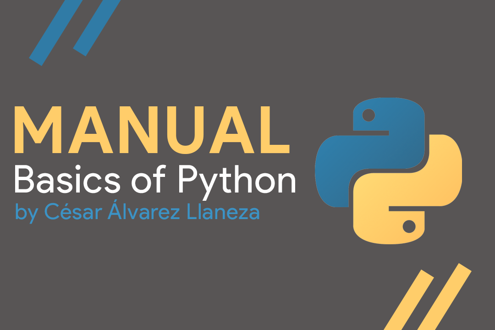

# Python-Manual


Manual of the Basics of Python - By César Álvarez Llaneza


## Your First Hello World
The first thing you learn when you start a new programming language if your first “Hello World”. And with Python will not be the exception.
Use print to show a text.  Inside the parentheses and citations we introduce the text that you want to show. 

`print(‘Hello World’)`

`Hello World`

*NOTE:* We can use “ ” or ‘ ’ it works the same:
`print("Hello World")`
/Hello World/

## Variables
Use a variable to define a value.  (Use ‘_’ for space between words).
Variables with characters (/Strings/) use citations (/“ ”/) between them & for numbers don’t.

`character_name = “Cesar”`
`age = 22`

To use variables in /‘print’/ you need to use /‘+’/  to include it.
`print(‘Hey my name is:’ + character_name)`
/Hey my name is: Cesar/

There’s also /boolean variables/ this are define by a *True* or *False* definition.

`male = True`
`female = False`

Important things to remember when you’re working with /Strings/:
* /\n/ - line break 
`print('Hello \n Good Morning')`
/Hello/
/Good Morning/

* /\”/ - so the symbol can appear in the print
`print(‘Hey my name is: \” ‘ +character_name + ‘ \”’)`
/Hey my name is: “ Cesar “/


### Strings

We can also use something call *concatenation*.
This is basically the process of taking a string and appending another string into it.

```
phrase = "Learning Python"
print(phrase + "is easy.")
```
/Learning Python is easy./

Strings can also use *functions*.
This functions change the format of the text.
If you type /‘.’/ after the variable you will get selection of functions.

For example:
 `print(phrase.lower())` -> will show the text in lower case.
 `print(phrase.islower())` -> will get a FALSE value.

We can also use this functions in combination with each other.
`print(phrase.lower().islower())` -> will get a TRUE value.

To figure it out how many characters there’s inside a string we use the /len/ function and inside the parentheses we introduce the variable.
`print(len(phrase))`
/15/ <- Number of characters in the string.

We can also get individual characters inside a string.  For this we use an open and close square bracket /[]/ and inside we specify the index of the character that you want to graph.

`print(phrase[0])`
/L/ <- L is the first character of “Learning Python”.

/*Note*: the first character of a string starts with a ‘0’/ 

There’s also the _index_ function, that works exactly the opposite to the past one.
This function will tell you where a specific character is located in the String.
This is called /“Passing a Parameter”/.

`print(phrase.index("e"))`
/1/ <- Position of the character “e” on the string.

With the _replace_ function, you can replace a parameter for other.
`print(phrase.replace("Learning", "Studying"))`
/Studying Python/ <- “Learning” was replaced for “Studying” in the string.


### Numbers

Numbers is the most common data type used in Python. We’re going to learn the basics of using numbers, as the different types of numbers that can we represent in Python.  As well as the awesome functions that can we use with numbers. 

Numbers are easy to print as just typing the number inside the brackets.
`print(19)`
/19/

This numbers can be decimals and/or negative, Python will print it without a problem.
`print(-2.3)`
/-2.3/

We can also use basic arithmetic. Such like addition (+) , subtraction (-), multiplication (*)  and division (/).
`print(6.5 + 4)`
/10.5/

We can use parentheses to change the order of the operation.
`print(2 * (2 + 3))`
/10/

There’s also the modulates operator present with the /‘%’/ , this operation do is to take the first number divided by the second number, it’s going to spit out the remainder.
`print(10 % 3)`
/1/

You can print variables that contain numbers.
```
number = 23
print(number) 
```
/23/

If you want to print a variable with a number next to string. You will get an error. For this to work you need to convert the number into a string, we use the /str/ function.
`print(str(number))`

So now you can print the number next to a string.
`print(str(number) + “ is my favorite number.”)`
/23 is my favorite number./

One of the most common functions that you will is the /pow/ function, this function will allow you to pass two pieces of information. The first will be a number and the second is going to be the power that you want that number.

So 3^2 will be represented this way:
`print(pow(3, 2))`
/9/

Other very useful function is /max/, this function will print the higher number that you introduce.
`print(max(22, 23))`
/23/

The function /min/ does exactly the opposite of the /max/ function, prints the lower number that you introduce.
`print(min(22, 23))`
/22/

The round function, will round a number. From 1-4 is goes down to 5-9 it goes up.
`/print(round(3.4))/`
/3/
`/print(round(3.5))/`
/4/

## Inputs
Inputs allow users input information into our program. You will take this information and introduce inside a variable. Then you can work with that variable.

Here we ask the user to introduce their favorite color:
`color = input("Enter you favorite color: ")`
/The machine will ask the user to type their favorite color./

When you want to input a number, the machine will consider it a string. For you to use this value as a number you need to convert it.

/int/ for whole numbers (Ex: 10)
`int(number)`

/float/ for decimal numbers (Ex: 2.56)
`float(number)`

In this code we asked the user to introduce two number (num1 & num2) after that we added both number. Finally we print the result of this operation:
```
num1 = input("Enter the first number: ")
num2 = input("Enter the second number: ")
result = int(num1) + int(num2)

print(result)
```


## Lists
Lists is essentially just a structure that we can use inside a Python so you can manage and organize large amounts of data. Lists make keeping track of data a lot easier. 

Inside the list we can store strings, numbers or even booleans.

For example here we will create a list of /“animals”/:
`animals = ["monkey", "elephant", "shark"]`

We can simply print the list and you will get all the values:
`print(animals)`
/["monkey", "elephant", "shark"]/

You can also print each element with their /index/. In this case /“monkey”/ has an index of 0, /“elephant”/ = 1 and /“shark”/ = 2. This because we start indexing at index position of zero.

For example here we will /“elephant”/ that’s in the position 1:
`print(animals[1])`
/elephant/

You can specify the range of your list, the first number will from where it starts taking values and the second where it finishes

For example here we will take the values from position 0 to the position 1.
`print(animals[0:1])`
/["monkey", "elephant”]/

There’s also the possibility to access and element and modify it.
Here we will change /“elephant”/ for /“wolf”/:
`animal[1] = "wolf"`


### List Functions

There’s a lot of functions that we can us with lists. This functions allows us to modify the lists, get information about the lists and so on.
Here we will show you the most common and the most popular functions. To make lists more powerful and more easy to use.

* The first function you will learn is the /extend/ function, this function will combine two lists together.

Here we will combine the list /“names”/ with the list of /“colors”/:
```
names = ["John", "Max", "Will"]
colors = ["Green", "Blue", "White"]
names.extend(colors)
```
/[“John”, “Max”, “Will”, “Green”, “Blue”, “White”GW]/


* You can also add individual elements at the end of the list with the /append/ function.Here we will add another name to the /names/ list:
`names.append("Jake")`


* There’s also the option to add the element in chosen part of the list with the /insert/ function. In this function we give two values: the first one is the position where we want to add the element and the second one the element we want to add. The rest of the values will pushed to right.

Here we will add another name in the position “1” of the list of /“names”/:
`names.insert(1, "Brad")`

* You can also remove any value from the list with the /remove/ function.
Here we will remove /“Brad”/ from the list:
`names.remove("Brad")`

* To simply remove all the list and start clean, you use the /clear/ function. That will remove every single value from the list.
Here we will eliminate all the names from the /names/ list:
`names.clear()`

* You can also search for a value from the list with the /index/ function and it will give you the index in which is located the value.
Here we will search for the color green in the /colors/ list:
`print(colors.index("Green"))`
/0/

If you search for a value that is not in the list you will get an error
For example, here we will search for a color that isn’t in the list:
`print(colors.index("Black"))`
/ERROR/

* You can also count how many times a value appears in a list. With /count/ function.
Here we will count how many time the color /“blue”/ appears in the list of /“colors”/:
`print(colors.count("Blue"))`
/1/

* There’s also a function to order the values in alphabetical or numerical (depending of the values) order. With the /order/ function.
Here we will order the /“colors”/ list in alphabetical order:
```
colors.sort()
print(colors)
```
/[‘Blue’, ‘Green’, ‘White’]/

The /reverse/ function does exactly the opposite, from last to first.
Here we will reverse the /“colors”/ list in alphabetical order:
```
colors.reverse()
print(colors)
```
/[‘White’, ‘Blue’, ‘Green’]/

* One function that comes really handy is the /copy/ function, this function copies the values of a list and creates a new one. So you can work with it without modifying the original.
Here we will copy the /“colors”/ list to /“favorite_colors”/ list:
`favorite_colors = colors.copy()`


## Tuples
A tuple is a type of data structure it is basically means that is a container where you can store different values. Tuples are very similar to lists. But it has key differences from lists. Tuples are used for more niche situations.

The two main difference are:
1. Tuples are written inside parentheses
2. Tuples can’t be modified or changed. What you see is what you get.

* First we will learn how to create a tuple. Here we will create a tuple for coordinates:
`coordinates = (7, 3)`

* You can access different values of tuples just like with lists.
Here we will access the first coordinate of our tuple:
`print(coordinates[0])`
/7/


## Functions
Just as we already seen before functions are basically a collection of code which performs a specific task. Functions help you to organize your code a lot better. They are core concept of programming on Python. 

For indicating a function we write /def/ before the name we want to give to the function.

Here we will create a function that says hi to use:
```
def say_hello():
		print("Hello User")
```

The code inside a function is only going to get executed when we specify that we want to execute it. Now for us to execute the function we need to do something called /“Calling the function”/. This is simply typing the function.

Here we will call our function:
`say_hello()`
/Hello User/

To make this functions more powerful, we can give them information. This information is called /parameters/. 
Here we ask the user to include a parameter /“name”/ of the user:
```
def say_hello(name):
		print("Hello " + name)

say_hello("John")
```
/Hello John/

You can include as much parameters as you want.
Here we will add also the parameter /“age”/:
```
def say_hello(name, age):
		print("Hello " + name + ", you are " + age)

say_hello("John", "25")
```
/Hello John you are 25/


### Return Statement

Sometimes when we call a function we’re actually going to want to get information back from that function. That’s when the /return/ keyword can comes handy. The /return function/ can allow us to return back a value.

Here we will create a function to make the cube of a number:
```
def cube(num):
    num*num*num

print(cube(3))

```
/None/ <- We don’t get the value that we want

For getting the value that we want to print we need to use the /return statement/ in the equation:
```
def cube(num):
    return num*num*num

print(cube(3))

```
/27/ <- Now we can see that we get the value that we want

We can also store the results in a variable:
```
def cube(num):
    return num*num*num

result = cube(4)
print(result)
```
/64/

*NOTE:* Any code written after the return keyword in the function will not be counted, the return statement breaks out of the function.

## If Statements
If statements are a special structure inside Python, where we can help our programs make decisions. So by using the if statement We can execute certain code when conditions are true and execute other code when other conditions are true. So basically statements allow our program to the input that they are given. 

Here we will have an example, We create a boolean that gives a true value that we are a male, then with an /if statement/ if “is_male” is true we will get the print text:
```
is_male = True

if is_male:
		print("You are a male")
```
/You are a male/

If we change “is_male” to False we will not get the text because the if statement only works when “is_male” is /True/:
```
is_male = False

if is_male:
		print("You are a male")
```

But if we add an else function when “is_male” gives a /False/ value:
```
is_male = False

if is_male:
		print("You are a male")
else:
		print("You are not a male")
```
/You are not a male/

We can add more than one condition in our /if statement/ with adding an *“or”* operator in the condition. In this example we will add also the possibility to be tall.
```
is_male = False
is_tall = True

if is_male or is_tall:
		print("You are a male or tall")
else:
		print("You are neither male or tall") 
```
/You are a male or tall/ <- We got the first message because it had a least one condition that we asked for (is_tall = true).

We can also add the *“and*” operator. It works similar to the “or” operator but in this case _both_ conditions have to be True. 
```
is_male = False
is_tall = True

if is_male and is_tall:
		print("You are a tall male")
else:
		print("You are not a tall male") 
```
/You are not male and tall/ <- We get the second message because one condition is false.

There’s also another keyword in Python called else if written /“elif”/. This keyword is used as another possibility when our first if condition is not true.

Here we will create an else if condition for males that are not tall:
```
is_male = True
is_tall = False

if is_male and is_tall:
		print("You are a tall male")
elif is_male and not(is_tall):
		print("You are a short male")
else:
		print("You are either not male or not tall or both") 
```
/You are a short male/

Here we will finish all the possible conditions from this two variables in this code:
```
is_male = False
is_tall = True

if is_male and is_tall:
		print("You are a tall male")
elif is_male and not(is_tall):
		print("You are a short male")
elif not(is_male) and is_tall:
		print("You are tall but not a male")
else:
		print("You are either not male or not tall or both") 
```
/You are tall but not a male/


### If Statements & Comparisons

Now we are going to see how to use comparisons in Python using if statements. We are going to look at another way to use if statements. Instead of using boolean variables we can actually compare different values.

Comparators that can be used:
* `>` (Greater)
* `<`  (Less)
* `>=` (Greater or equal)
* `<=` (Less or equal)
* `==` (Equal)
* `!=` (Not Equal)

In this case we’re going to compare different numbers. And it will give us the maximum number that we pass to the program, this function will take three parameters as input and going to print out the biggest number:
```
def max_num(num1, num2, num3):
    if num1 >= num2 and num1 >= num3:
        return num1
    elif num2 >= num1 and num2 >= num3:
        return num2
    else:
        return num3

print(max_num(1, 2, 3))
```
/3/ <- “3” was the biggest number given

Now we are going to create a more advance calculator,  we will ask the user to input two values and a operator:
```
num1 = float(input("Enter the first number: "))
op = input("Enter the operator: ")
num2 = float(input("Enter the first number: "))

if op == "+":
    print(num1 + num2)
elif op == "-":
    print(num1 - num2)
elif op == "/":
    print(num1 / num2)
elif op == "*":
    print(num1 * num2)
else:
    print("ERROR: PLEASE ENTER A VALID OPERATOR")

```


## Dictionaries
A dictionary is a special structure in Python which allow us to store information in what is called *“key value pairs”*.  We can use this keys to get reference from them. Just a normal dictionary just in this format the key is the word and the value would the actual definition.  Dictionaries will always be included inside open and closed curly brackets /{ }/. 

*Note:* We can’t have duplicate keys.

Here we will create a program to transform a three digit month date name to a full month name (Ex: Jan(key) -> January(value) ), between each key value pair we need to add a coma /,/ :
```
month_conversions = {
    "Jan": "January",
    "Feb": "February",
    "Mar": "March",
    "Apr": "April",
    "May": "May",
    "Jun": "June", 
    "Jul": "July",
    "Aug": "August",
    "Sep": "September",
    "Oct": "October",
    "Nov": "November",
    "Dec": "December",
}
```

Now we can access each one of this keys individually:
`print(month_conversions["Oct"]) `
/October/

We can also us the /get function/ to get the values:
`print(month_conversions.get(“Sep”))`
/September/

*Keys can also be numbers*, in this case we can associate the month to an individual number:
```
month_conversions = {
    1: "January",
    2: "February",
    3: "March",
    4: "April",
    5: "May",
    6: "June", 
    7: "July",
    8: "August",
    9: "September",
    10: "October",
    11: "November",
    12: "December",
}
```


## While Loop

A while loop is basically a structure in Python which allows us to loop through and execute a block of code multiple times. So you can specify a part of a code to loop through that code executing it repeatedly until certain condition was false. 

In this example we will create a loop where it will print the value of /“i”/ and after printing it, /“i”/ will increase by 1. Here the condition will be to less or equal to 3, this mean that when the value of /“i”/ reaches 4 the loop will stop:
```
i = 1

while i <= 3:
    print(i)
    i = i + 1
```
/1/
/2/
/3/

Now we will create a guessing game using the while loop:
```
secret_word = "Python"
guess = ""

while guess != secret_word:
    guess = input("Enter your guess:")

print("CORRECT, You win! ")
```

This code we can apply something to make it more complex, we will add a limit of guesses (3) and if the user doesn’t guess it in this 3 chances they lose the game:
```
secret_word = "Python"
guess = ""
guess_count = 0
guess_limit = 3
out_of_guesses = False

while guess != secret_word and not(out_of_guesses):
    if guess_count < guess_limit:
        guess = input("Enter your guess:")
        guess_count = guess_count + 1
    else:
        out_of_guesses = True

if out_of_guesses:
    print("You're out of guesses.")
else: 
    print("CORRECT, You win! ")
```


## For Loop
A for loop is a special type of loop in Python which allows us  to loop over different collections of items. So a lot of times we will use for loops to loop through different arrays, loop over the letters inside a string or we could just loop through like a series of numbers. So for loops provide a very specific purpose.  

Here we will show a simply example of how a /for loop/ works, we will specify we want to print each letter from the word given (in this case “Python”):
```
for letter in "Python":
    print(letter)
```
/P/
/y/
/t/
/h/
/o/
/n/

*Note:* the variable /“letter”/ can be named whatever you want, it can perfectly be /“index”/ and it will work exactly the same. Example:
```
for index in "Hey":
    print(index)
```
/H/
/e/
/y/

We can also create an array and print every single value inside that array:
```
directors = ["Martin", "Chris", "David"]

for director in directors:
    print(director)
```
/Martin/
/Chris/
/David/

There’s also the possibility print number, here we will give a specific range and it will give the values inside that range:
```
for index in range(3, 6):
    print(index)
```
/3/
/4/
/5/

Now using the for loop we will create a /exponent function/, we will give the base number (2) and the exponent number (3):
```
def raise_to_power (base_num, pow_num):
    result = 1
    for index in range(pow_num):
        result = result * base_num
    return result

print(raise_to_power(2, 3))
```
/8/


## 2D Lists and Nested Loops
 The concept of 2D is simply a list inside another list, for example here we will create a grid:
```
number_grid = [
    [1, 2, 3],
    [4, 5, 6],
    [7, 8, 9],
    [0]
]
```

We can print each individual value from of the grid, in the first square bracket [] we introduce the row and the second square bracket we introduce the the column, here will ask for the number /“2”/:
`print(number_grid[0][1])`
/2/

Nested loops are basically the same concept, but in this case there’s a for loop inside another for loop. Here we explain how to print every single value from the 2D list with a nested loop:
```
number_grid = [
    [1, 2, 3],
    [4, 5, 6],
    [7, 8, 9],
    [0]
]

for row in number_grid:
    for col in row:
        print(col)
```
/1/ /2/ /3/ /4/ /5/ /6/ /7/ /8/ /9/ /0/


## Comments
Comments are special lines in the code that are not going to be rendered by Python, comments are only used for humans to write a little instruction to know for what is a function used for, to use it as a reminder in the code or explain how the code works.  Comments are written after the hashtag symbol /‘#’/.

`# Comments are ignored by Python when you execute the program.`


## Try / Except
A lot of time when we’re writing code in Python programs you’ll encounter errors, so different situations will come up and your program might throw an error or it might through an exception, and a lot of times when these situations happen through completely stop your program from running. But what you can actually do is watch out for a certain specific errors that are going to pop up in our program and we can actually handle them. So instead of our program just breaking and stop executing, we can handle those errors and do things when they occur so. 

For example, take a look at this code:
```
# We ask the user to introduce an number, then we will convert to an int
number = int(input("Enter a number: "))

# Now we print the number
print(number)
```

Everything is okay, right? But what happens if the user introduces a letter instead of a number? Yeah, we will get an error.

This situations happened a lot, to prevent this we can handle it with the /try / except/ block, this will basically allow your programs to try out a piece of code, and if something goes wrong we can account on that.  

We will use the same code previously shown, but we will include a Error message if the user doesn’t input a valid value (a number) with the Try / Except block:
```
try:
    number = int(input("Enter a number: "))
    print(number)
except:
    print("Invalid input")
```

We can also create multiple excepts in the code when we specify the error that we are excepting, here we will add a division by 0 (That is no possible) and then create to different excepts:
```
try:
    value = 10/0
    number = int(input("Enter a number: "))
    print(number)
except ZeroDivisionError:
    print("Invalid division")
except ValueError:
    print("Invalid error")
```
Now each of the errors has it's own message.

One more important thing to know, is to store the error as variable and then the program will print what’s the problem:
```
try:
    value = 10/0
    number = int(input("Enter a number: "))
    print(number)
except ZeroDivisionError as err:
    print(err)
```
/integer division or modulo by zero/ 
